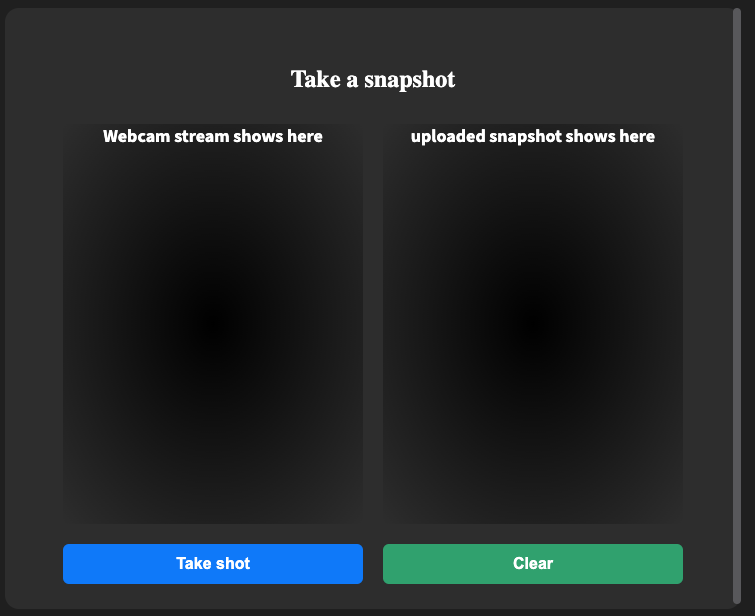

## SOCIAL Camera
 Simple photo taking app

# Tech Stack
* Used Minio as the S3 storage.
* AWS sdk used -- server.
* Postgresql is used as the db to store user credentilas.
* Sequleize is the ORM.
* JWT for authentication (Simple, 30 mins).
* SSL for all services.
* Converted backend to typescript.
* Frontend partially typescript (all my codes).


# Hosted
* Frontend  :   https://unbird.abendrot.net/auth 
* Backend   :   https://unbirdserver.abendrot.net
* S3        :   https://unbirds3.abendrot.net


# Minio is used for S3 storage.

## Development Minio

```
docker run -d -p 8000:9000 \
  -e "MINIO_ACCESS_KEY=minio" \
  -e "MINIO_SECRET_KEY=secretkey" \
  minio/minio server /data
```
> * Create a bucket named 'bucket'.
> * Change policy to '*' with read and write permission.

## Production
```http://192.155.85.26:8000```
> Access key : minio 
> Secret key : secretkey 

# Postgresql is the Database Engine
## Development Database
```
 docker run -e POSTGRES_PASSWORD=password -p 5432:5432 -d postgres
```


# Testing
> Jest is used as the testing library.

## Naming Scheme
Opted to use the scheme: 
`Expected Behavior -- When Test Case`


## RUN
 - cd into app folder and  run `yarn start`
 - cd into index folder and  run `yarn start`
 - client  runs on  http://localhost:1234
 - index  runs on  http://localhost:3000

## ISSUE TO COMPLETE

Feature description: 
Users want to be able to add profile picture to the Social Camera app. 
Given I’m a user, I want to be able to access my system camera, take a snapshot of my self and have that set as my default profile image

Implementation Details:

1. Clone the Social Camera repo. 
2. Using s3 When user snapshot is created, you want to make a call to the index to generate a PresignedURL
3. The S3 path should be bucket/yourName/randomUUID/avatar.jpg
4. Use that PresignedURL to upload the snapshot to your AWS s3 bucket
5. Update the client app with the s3 link
6. Allow users to save the created snapshot
7. Testing is not required but a plus

Dev Notes:
- All react components must be 100% react hooks
- All styling must be done using styled component
- Try and stick to the styling guide lines
- Create a clone of the base branch and push that to your GitHub account 
- The Repo should be private  yourName-social-camera eg (emurphy-social-camera)
- Branch out of the clone (feature/snapshot)
- When done or need more information, send the pull request URL to emurphy@girbil.com



